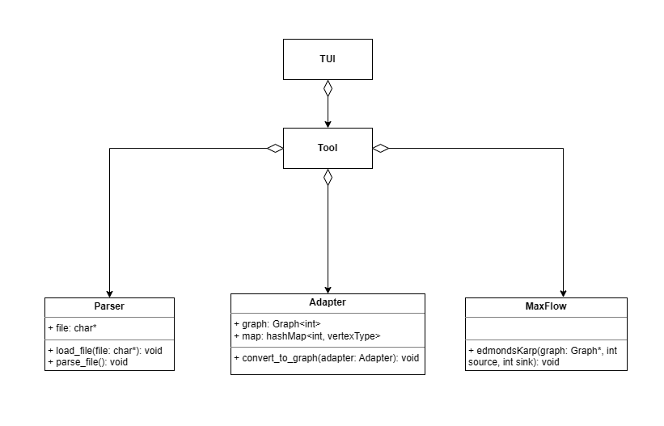
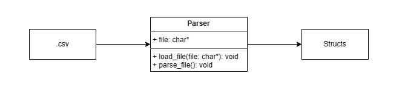
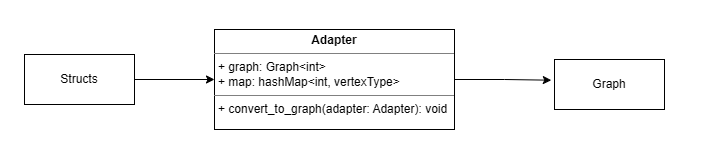

## Description
**This project was made for the subject "Desenho de Algoritmos" and the objective of this program is the following:**<br>
Given a set of articles with domains and a set of reviewers with expertise in certain domains, the goal is to find the best or one of the best distributions, knowing that reviewers can only review a maximum amount of articles and an article needs at least a minimum amount of reviewers.
If not all articles can be assigned reviewers, the program prints the unassigned articles.
<br>

Besides the main algorithm, there is a feature to find critical reviewers, that is: the reviewers that, if failing to do their assignment, will cause a failure.

## How to use
1º Press 2 in the main menu to select the dataset<br>
2º Write the relative path to the dataset<br>
3º Press 3 to run<br>

----

## Project structure


----

## Parser


### How does it work
The Parser class is responsible for reading and extracting structured data from the input file. The input file is divided into clearly marked sections (#Submissions, #Reviewers, #Parameters, #Control), and the parser reads each section to populate the corresponding internal data structures to be later handled by algorithms.

The parser works as follows:

To handle the submissions info, each line is tokenized to extract the submission ID and domain (primary and secondary). Non essential fields like title, authors, and email are ignored. The relevant information of valid submissions is stored in a submission structure, which is then stored in a vector of submissions.


In terms of reviewers, each reviewer’s ID and expertise domains (primary and secondary) are extracted similarly, skipping name and email fields. Valid reviewers are also stored in a reviewer structure and then in a vector.


When it comes to parameters, workflow parameters are read, such as minimum reviewers per submission and maximum submissions per reviewer, etc... . Values are stored in a parameters_ structure.


Lastly, to handle control settings, control information is read, trimming any surrounding spaces or quotation marks and saving the relevant info in a control_ structure.

The parser uses line-by-line reading and tokenization (std::strtok) to convert CSV input into structured objects. Helper functions handle string-to-integer conversion, trimming whitespace and quotes, and validating input values.

The main entry point, parse_file(), locates each section in the file and calls the appropriate parsing function, ensuring that all data is loaded and ready for further processing.

**So, in summary, this class is responsible for:**

- Modular parsing for each data type (submission, reviewer, parameters, control)

- Handling invalid entries adequately

- Preparing all data for subsequent algorithms (Maximal Bipartite Matching, etc...) and menu-based interfaces


### Why does it need to read the file from the start for each header 
Due to some irregularities in the dataset file (e.g. An '#' between Submissions and Reviewers) and some doubts about the .csv structure (e.g. Can the topics have a different order), led us to make the decision to create the most generic parser to avoid problems in the future.

### Time Complexity
Let l be the number of lines and h be the number of headers,the upper bound can be defined to be O(l * h).
So in this project, the time complexity to parse the dataset is O(4 * l) = O(l)

----

## Adapter


### How does it work
The adapter class...    

### Time Complexity:
Because it creates the graph, the time complexity is O(V + E)
<br>V: number of vertices
<br>E: number of edges

-----

## MaxFlow
### How does it work
In order to obtain the best distribution, we decide to use Edmonds-Karp algorithm.
Although, the Ford-Fulkerson algorithm could give a more efficient result, due to the maximum flow, in the worst case, being 2 times the number of articles.

### Time Complexity
Because it creates the graph, the time complexity is O(V * E²)
<br>V: number of vertices
<br>E: number of edges

-----

## Tool
### How does it work
The adapter class...    

----

## Risk analysis (k = 1)
### What is risk analysis
Risk analysis is the search for the set of reviewers in which are critical for the final result, i.e. if the reviewers in which if they fail to accomplish their work will result in one or more articles not having sufficient reviews.
<br>For k = 1, we need to find which reviewers alone could cause in failure.

### How does it work
The key to find the critical reviewers is to analyse the residual graph. If we traverse the residual graph (using the augmented paths) from a node, we will have two types of nodes:
- visited
- unvisited


And the key for the success is in the unvisited ones that tells us that all paths which are able to reach that node are saturated and there is no other path to reach it that starts from the starting node. That means if we remove one incoming edge from the node, the maximum flow would decrease. 
<br>With that idea in thought, we just need to traverse the graph from source through the residual graph, then we filter from all unvisited nodes the articles and we know that all reviewers who are reviewing the article are critical.

### Time complexity
The BFS takes O(V + E) and then we search for unvisited submissions and for their edges (O(V * E)). We can define our algorithm as O(V * E).
<br>But because the number of edges in this project is smaller or equal to 2, i.e. it is constant, the BFS is the part which takes more time. 
<br>Overall: O(V + E)


-----

## Risk analysis (k > 1)
### Pseudo-code
```python
res = list()
list = generate_all_comb_of_reviewers(k)
for (comb in list)
    new_graph = graph - {reviewers in comb}
    if (max_flow(new_graph) < max_flow(graph)) add_to_res() 

return res
```

### Time complexity
We would need to generate all combinations with k nodes, so we would need O(combinations of r choose k), let r be the number of reviewers.
And for each combination, we would need to recalculate the maximum flow thus taking in the end O(combiations of r choose k * V * E²)

## Credits
**This program was made by**
- Francisca Baldaia da Silveira
- Tiago Alexandre Rodrigues Botelho
- Tiago Su
